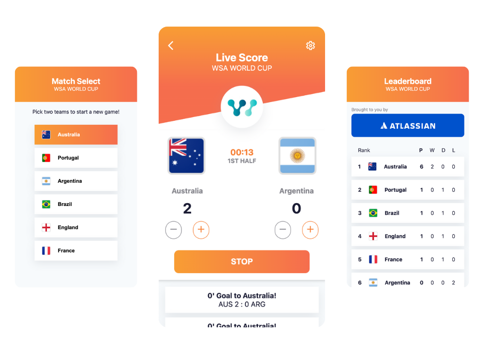
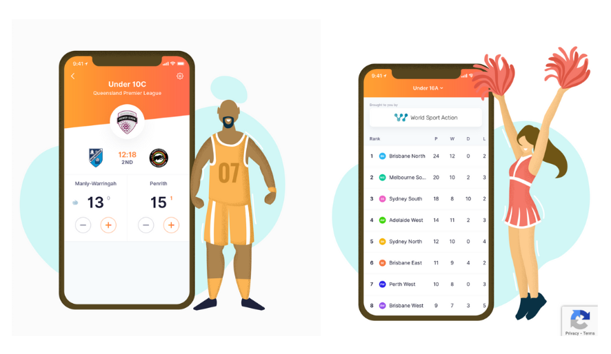

# WSA - Live Score App

This is a simple live-scoring app created for the World Sports Action (WSA) Football World Cup. The application was built using React JavaScript and implements a mobile-first design. The app applies the BEM methodology for Sass styling and makes reference to the mockups on the WSA website.

Screenshots from my demo app (above) vs reference mockups from WSA website (below)

## MVP

Create a "simple" live-scoring app that allows you to:

- [x] Select two teams and create a new game.
- [x] Add and remove scores to a match.
- [x] Submit the scores and add points based on the outcomes of the game.
- [x] View the leaderboard in order of points ranking.

## Features

- Implements the ability to start and stop the time clock based on the phases of a soccer (football!) game, such as first half, halftime, and game end.
- Considers the user experience by displaying and disabling buttons appropriately.
- Displays a messagebox detailing the game minute, team that has scored, and overall score every time a team scores.
- Uses styling that references WSA mockups.
- Although the app is designed for mobile devices, it incorporates mixins and media queries to adjust for desktop sizes.
- Addition of a favicon, a small detail missing from the current WSA website.

## Things to improve

Ideally, I would first discover the (business) requirements of the application through a product designer or a user. However, there are a few improvements I would make:

- Integrating a backend and database or storing to local storage.
- Including player data such as names, number, lineup, bench players, goals scored, and cards.
- Allowing for the recording and addition of messages for goal scorers, yellow and red cards, and substitutions.
- Handling the addition of extra time to the game clock.
- Handling accidental clicks.
- Managing penalty shootouts in the event of tied game.
- Managing own-goals and the list of players who could potentially score goals for a team.
- Tracking substitutions and identifying who is in the game and who is on the bench, as well as how to deal with substitutions for red cards.

## Challenges/Reflection

- As you can see from the list of things to improve, it was difficult to determine the scope of the project in terms of keeping it as simple as possible. Even though I had mocked up different versions of the app (see InProgress folder), I had to cut down features to fit into a shorter time-frame and a simpler demo.
- I had spent a considerable amount of time troubleshooting a bug, which in the end turned out to be just an error with a button element. The error was not picked up by the errors thrown in React logs, so it was difficult to pinpoint. It helped to isolate the components and use console.logs to get to the bottom of the problem - The benefit of app components!
- It was such a good feeling to resolve the bug and see the working app - it made it all worthwhile!

## Useful resources

- [setInterval in React](https://sebhastian.com/setinterval-react/)

---

### Reachout

- [LinkedIn](https://au.linkedin.com/in/ayushjames)
- [Email](mailto:ayushpjames@gmail.com)
